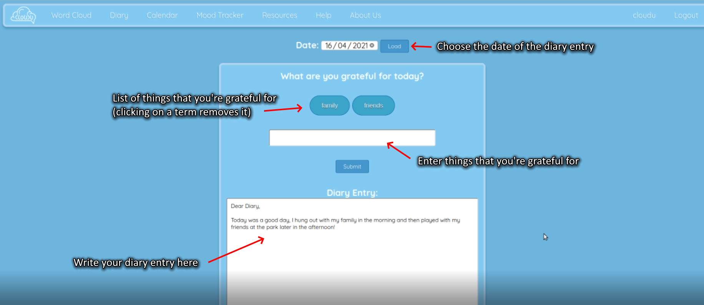
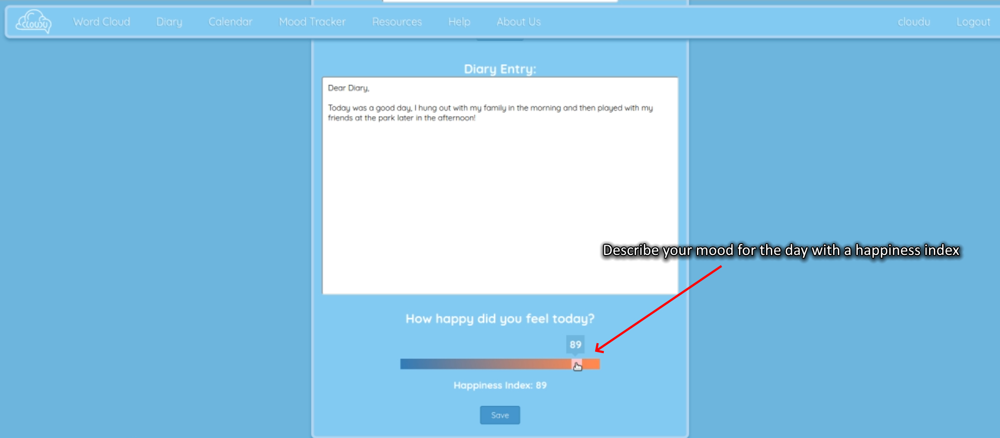
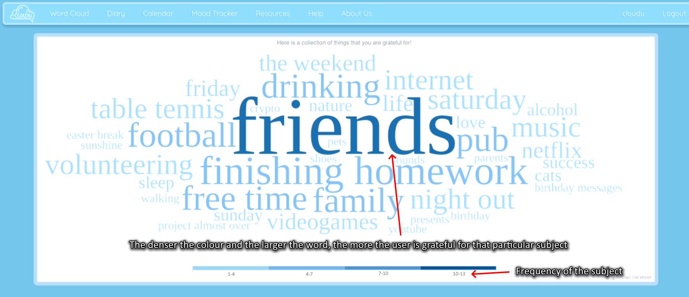
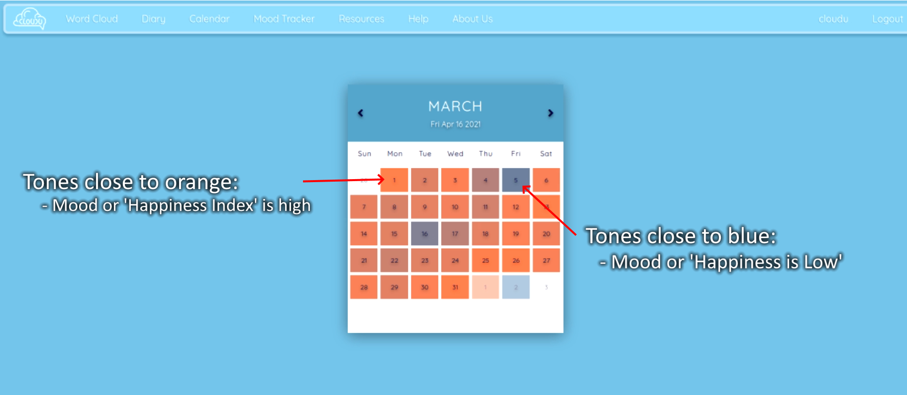
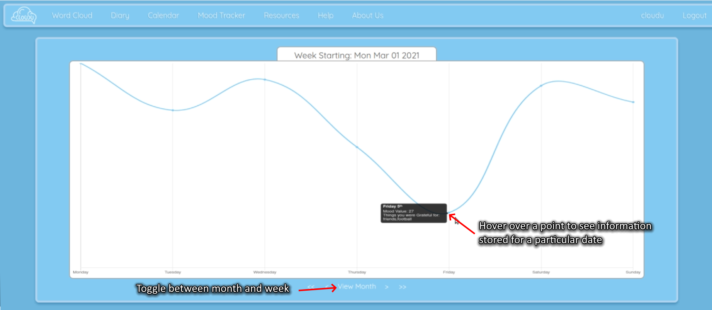
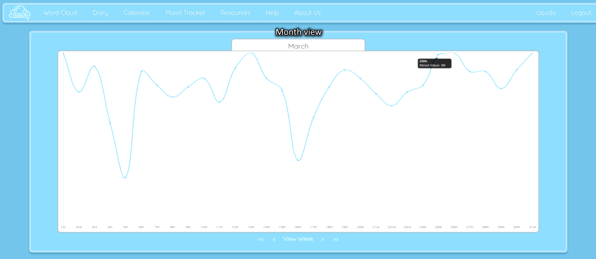
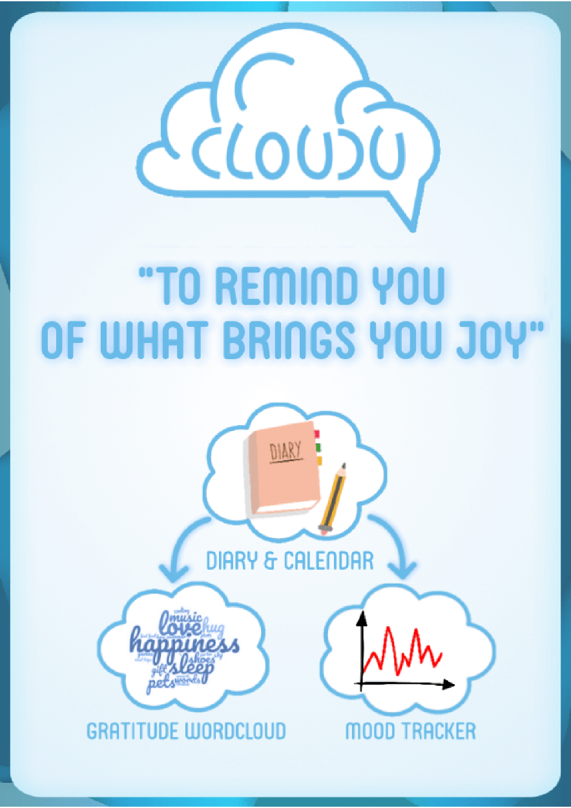

# CloudU

This is a first year project which makes use of PHP, HTML, Javascript and CSS to create a series of tools designed to allow a user to document their thoughts and emotions. The application revolves around the idea of gratitude journalling in conjunction with mood tracking so that the user is able to see what they're most grateful for.

Informational Video by Tony Lay
<video src='https://drive.google.com/file/d/1lliDj9KhWyliE5_gcJ6E7UsFMCO0mooA/preview" width=640/>

## Table of Contents

  * [🗺️ Overview](#-overview)
  * [📖 Gratitude Diary](#-gratitude-diary)
  * [☁️ Gratitude Word Cloud](#-gratitude-word-cloud)
  * [📅 Heatmap Calendar](#-heatmap-calendar)
  * [📈 Mood Tracking Graph](#-mood-tracking-graph)
  * [🖼️ Poster](#-poster)
  

## 🗺️ Overview

In order to help a person have control and understand their daily emotions, we believe that it's important that they write down what they're grateful for on a day-to-day basis. This is done through our Gratitude Diary, the contents of which are stored securely in the university's database and projected in multiple ways. See Gratitude Word Cloud, Heatmap Calendar and Mood Tracking Graph to see how the data is visually projected.

## 📖 Gratitude Diary

In the gratitude diary, the user can select a date to write a diary entry in. Choosing a date that has already been written in loads all of the relevant data stored for that date. The user can then do the following things:
  * Write down the things they're grateful for (Word Cloud, Mood Tracker)
  * Write an entry that describes what they've done today and how they're feeling
  * Provide a rating of their mood from 0 to 100 (Mood Tracker, Calendar)

The words in brackets are the features that make use of the information described in each bullet point.

## ☁️ Gratitude Word Cloud

Once the user has enough entries in their gratitude diary, a projection of the things that the user is most grateful for is shown in the form of a Word Cloud!

## 📅 Heatmap Calendar

Our calendar projects the mood of the user on specific dates, and diary entries can be accessed directly from this calendar as well.

## 📈 Mood Tracking Graph

The mood tracking graph tracks the mood of the user over a given week or month - hovering over certain points on the graph displays what the user is most grateful for on the day.

## 🖼️ Poster

Poster by Tony Lay

